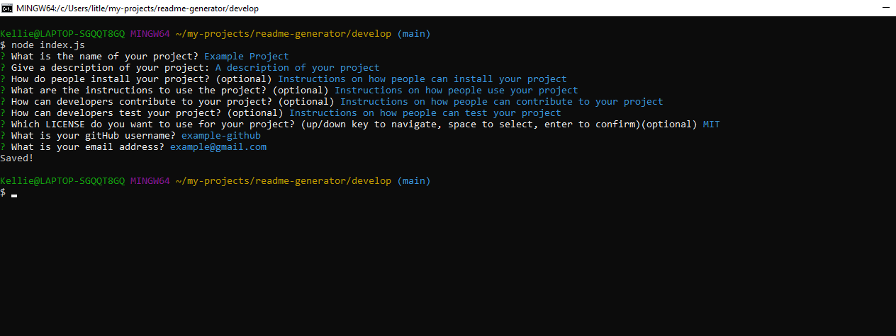
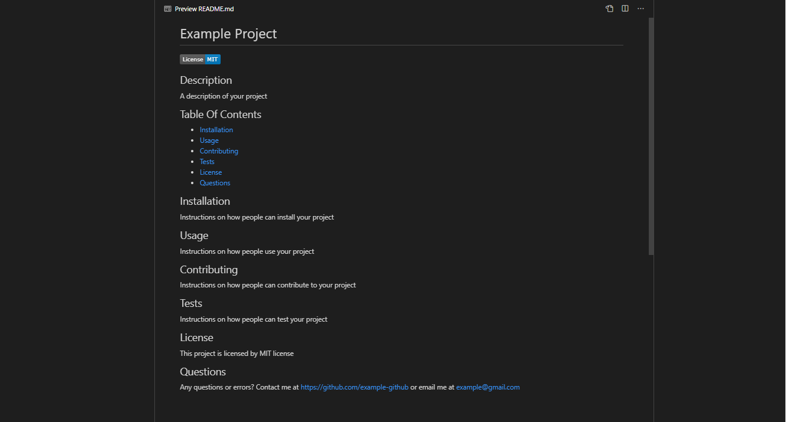

# Readme Generator
## Description
A program for the user to easily generate a README file for their project

## Screenshots
A screenshot of the terminal in action and the example README file

## Usage
Here is a link to a short video explaining how it all works!

[Video Link!](https://drive.google.com/file/d/1URcmA0Qz8vbvIaLMtCKAMjzPZ-STu6Bm/view?usp=sharing)

